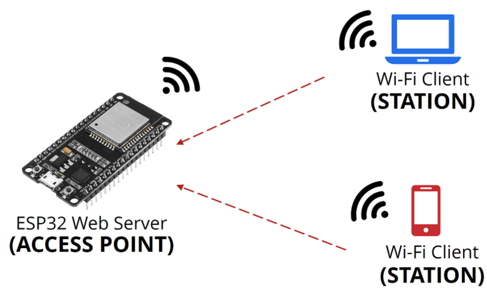
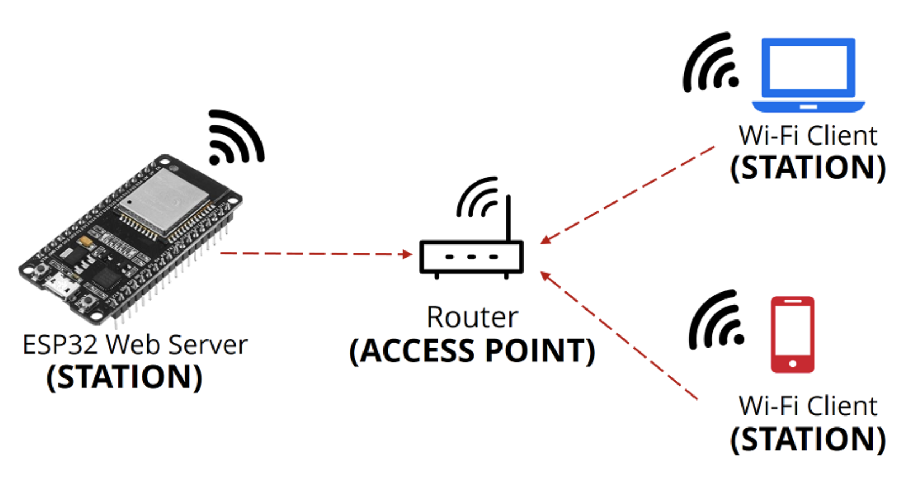
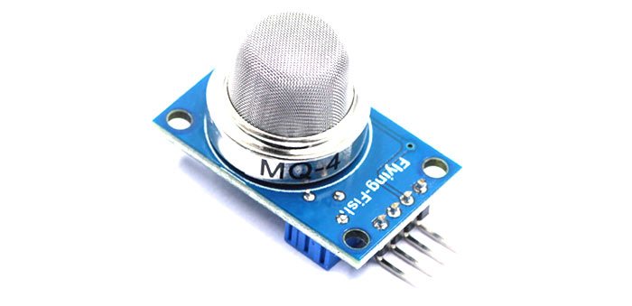
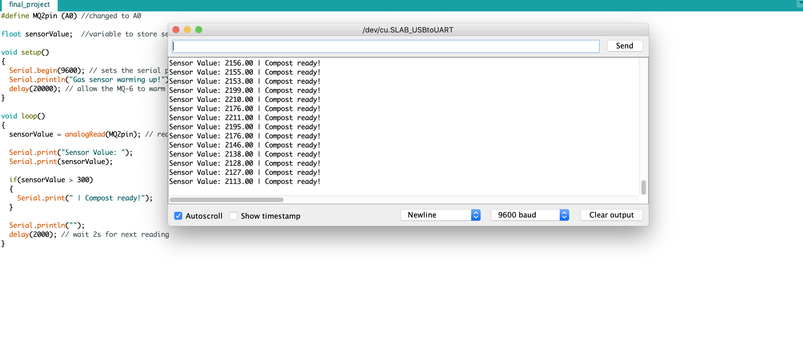
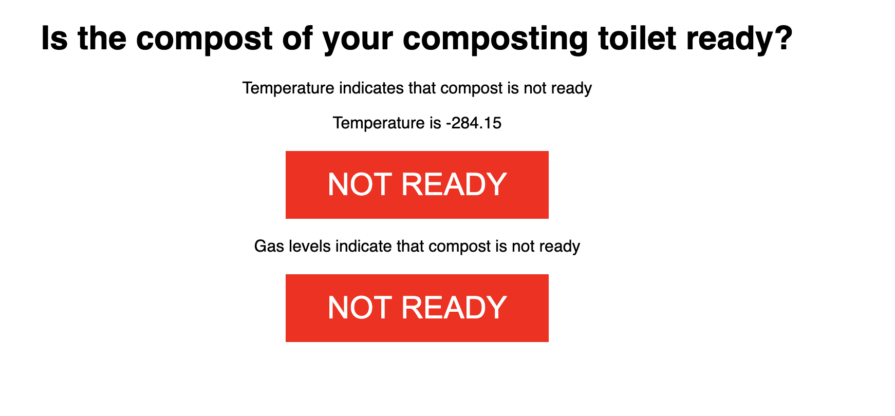
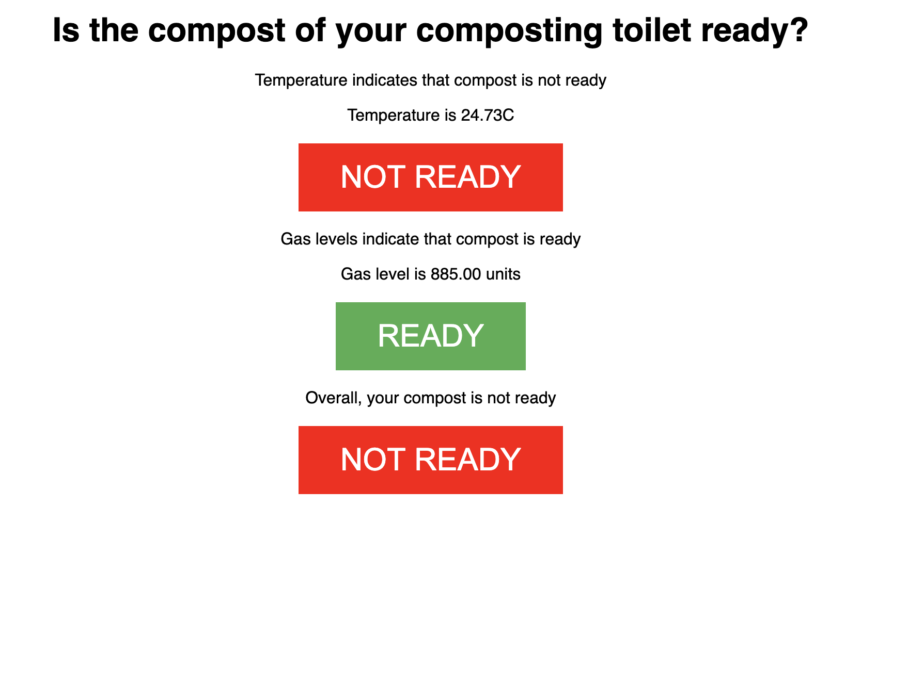
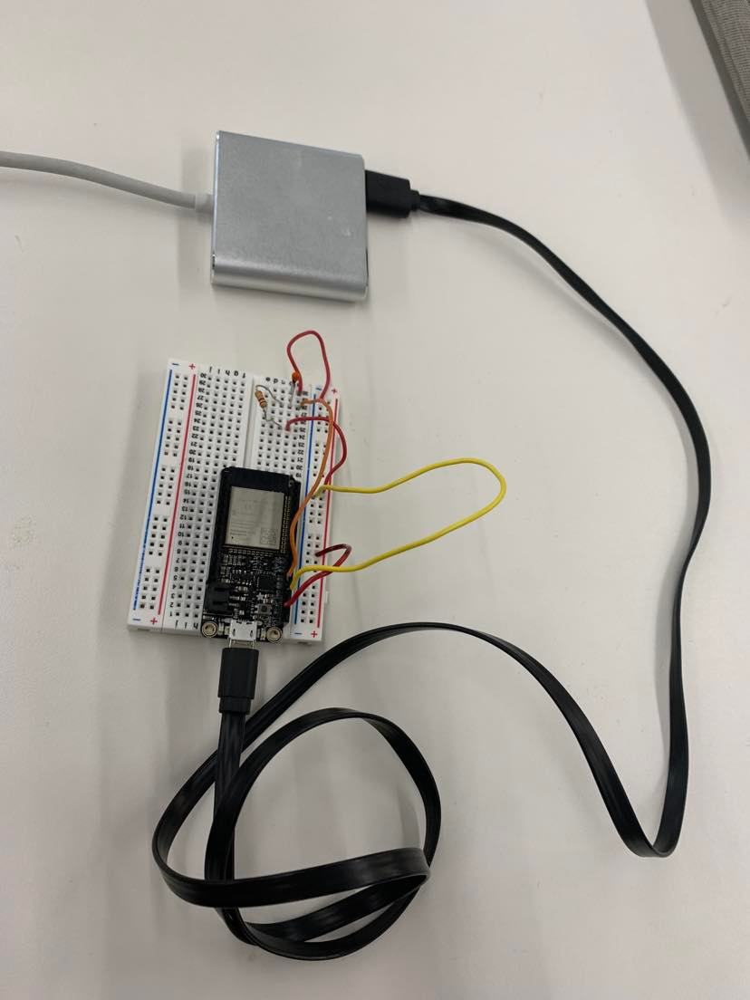
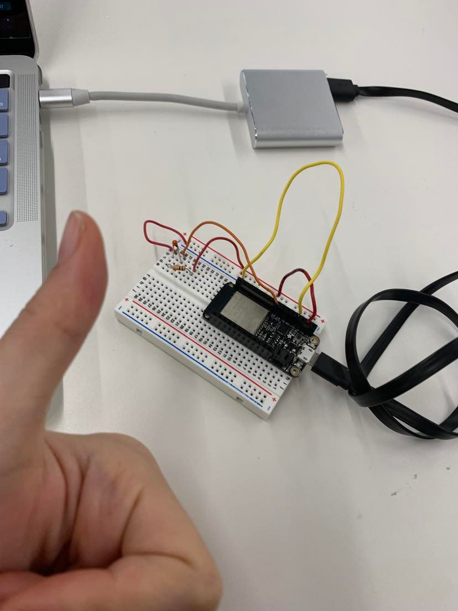
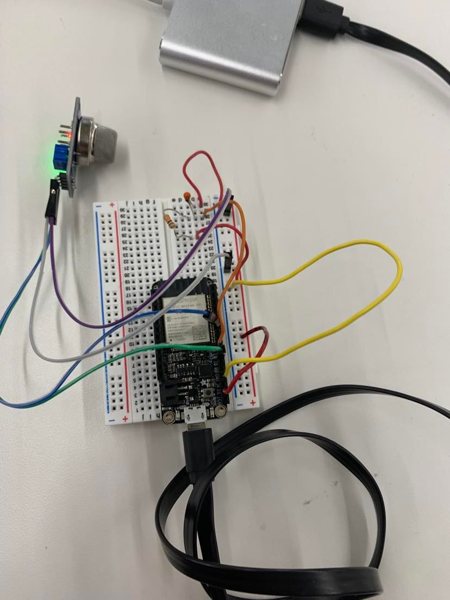

# Week 9: Radio, WiFi, Bluetooth (IoT)

For another week that incorporates Wifi documentation, check out my work on
[week 11](./11_compost_sensor.mdx), which mentions both the Wifi component and
also the html display component! :)

## Assignment

Demonstrate communication between a microcontroller and another device.
Optionally, work with a partner to control a device remotely.

## Background on Project

Part of my final project includes communication between my microcontroller and
another device. In essence, I want to have my temperature and my gas sensor to
be the input and be able to go to a website that will tell you if the compost is
ready based on the gas and temperature input. Thus, this week, I am trying to
see if I could have my ESP32 act as an access point!

What is an access point? Well, this picture from Random nerd tutorials sums it
up pretty well. Essentially, when the ESP32 serves as an accesspoint, it looks
something like the following:



The way Randomnerdtutorials describes it is "In simple words, when you set the
ESP32 as an access point you create its own Wi-Fi network and nearby Wi-Fi
devices (stations) can connect to it (like your smartphone or your computer)."

This in contrast to when a router instead acts as an access point.



The premise of my final project is that people can check in on if their compost
is ready based on a couple of factors like temperature and methane levels.
Hence, it makes sense to have ESP32 act as an access point, because since the
toilet can be in more rural areas, there might not necessarily be a router
nearby.

## Overview

Here is a big picture overview of what happens:

1. First, I will wire up my breadboard for the thermistor and make sure my
   temperature code is working
2. Them , I will wire up my breadboard for the gas sensor and make sure my gas
   sensing code is working.
3. With each of these components underway, I will then merge these components
   together and get the access point component to work.
4. I will then have code to essentially set up the access point stuff, for
   instance putting in information like what I want to call my ESP32 access
   point and the password to login to the access point. I will also design the
   website to have three buttons. One will show if the gas levels indicate that
   the compost from the composting toilet is ready. One button will show if,
   overall, the compost is ready.
5. When I upload and run the accesspoint temperature + gas code on the Arduino,
   I should get an IP address in the serial monitor
6. I will login to the ESP32 network and type in the password
7. I will then press the restart button on my Arduino, and watch as the website
   updates to see if my compost is ready.

## Thermistor

I first ran the codes for the thermosister and the gas sensor separately to make
sure it was working. I decided to do this before trying to integrate the
accesspoint feature. For some reason, although I've previously worked with the
following temperature code, it just wouldn't work this time. I tried the files I
worked with and adapted previously by swapping out different variable names and
ensuring the Farenheit temperature was being printed out. I also went to the
source and tried using the original code. However, I kept on getting negative
temperatures and other malfunctions.

Code adapted from
(https://create.arduino.cc/projecthub/Marcazzan_M/how-easy-is-it-to-use-a-thermistor-e39321)
that didn't work this time:

```c

//Thermometer with thermistor

/*thermistor parameters:
 * RTI: 10 000 Ω
 * B: 3977 K +- 0.75%
 * TI:  25 C
 * +- 5%
 */

//These values are in the datasheet
#define RTI 10000   // Ω
#define B 3977      // K
//--------------------------------------


#define VCC 3.3    //Supply voltage
#define R 10000  //R=10KΩ

//Variables
float RT, VR, ln, TE, TI, VRT;

void setup() {
  Serial.begin(9600);
  TI = 25 + 273.15;                 //Temperature TI from datasheet, conversion from Celsius to kelvin
}

void loop() {
  VRT = analogRead(A0);              //Acquisition analog value of VRT
  Serial.println(VRT);
  VRT = (3.30 / 1023.00) * VRT;      //Conversion to voltage
  VR = VCC - VRT;
  RT = VRT / (VR / R);               //Resistance of RT
  Serial.println("RT/RTI");
  Serial.println(RT/RTI);

  ln = log(RT / RTI);
  Serial.println("Ln");
  Serial.println(ln);
  TE = (1 / ((ln / B) + (1 / TI))); //Temperature from thermistor

  TE = TE - 273.15 -11;                 //Conversion to Celsius

  // Serial.print("Temperature:");
  // Serial.print("\t");


  Serial.print(TE);
  Serial.print("C\t\t");

  Serial.print(TE + 273.15);        //Conversion to Kelvin
  Serial.print("K\t\t");

  Serial.print((TE * 1.8) + 32);    //Conversion to Fahrenheit
  Serial.print((TE * 1.8) + 32);
  Serial.println("F\t\t");


  delay(500);

 // if TE > 26
  //else

}

```

Hence, I decided to run Rob Hart's temperature code instead, and this went well.

Code from Rob Hart:

```c
/*
Thermistor_read.  Robert Hart June 2020.
Using  datasheet for 10k NTC thermistor (Digikey Part No.).  https://www.vishay.com/docs/29049/ntcle100.pdf
with constants A and B to calculate Temperature from Resistance.
10K resitor in series to make a simple voltage divider.
*/
int ThermistorPin = A0;
int Vo;
float R1 = 10000;
float R2, T;
float A = 3.354e-03;
float B = 2.5698e-4;

void setup() {
Serial.begin(9600);
analogReadResolution(12);                 //Using a 32-bit ATSAM microcontroller that has up to 12 bit resolution. 4095 max.
}

void loop() {

  Vo = analogRead(ThermistorPin);
  R2 = R1 * 1/(4096.0 / (float)Vo - 1.0);         //Calculate resistance of thermistor from voltage divider math.
  T = (1.0 / (A + B*log(R2/R1) ));                 // Calculate temperature using datasheet formula.
  T = T - 273.15;                                   //Convert from Kelvin to Celcius.


  Serial.print("Temperature: ");
  Serial.print(T);
  Serial.println("C");

  delay(500);
}
```

Thus, I decided to use Rob's code for my final rendition.

## Gas Sensor

There are lots of different types of gas sensors. I decided to use a MQ-4
because that detects methane and CNG gas (compressed methane), since methane is
a byproduct of compost. This website details what the different gas sensors
detect for future reference: https://www.mysensors.org/build/gas



I then tested the gas sensor to make sure it worked. To note, the gas sensor
lights up green when it is plugged in correctly.

I then tried running the code I found here It's a really simple code that
Moreover, the gas sensor needs time to warm up, so it accounts for that time
also.



## Integrating the different codes

Now, essentially, I have three pieces. I have the temperature sensing code. I
have the gas sensing code. And lastly, I have the sample code on the Random Nerd
Tutorials Website
(https://randomnerdtutorials.com/esp32-access-point-ap-web-server/) that
essentially tells you if your LED light is on or off through accesspoint.

I then integrated the different pieces together.

_First of all, I tried integrating the temperature aspect. It was super weird
because Rob's temperature code worked for me when I was just trying to detect
temperature without the access point aspect. However, once I tried integrating
it into the access point code and trying to make the temperature detectable
through my IP address, it didn't really work_

However, ADC2 pins cannot be used while using the WiFi library (most ESP32
projects). ADC 1 pins are okay - that's 32-39, which, for the adafruit Huzzah,
includes 32=A7, 33=A9, 34=A2, 36=A4, 39=A3.

Thus, that's why I couldn't initially have the temperature show up correctly.

For instance, this was my interface, which was wrong given that I shouldn't be
getting a negative temperature.



Below is the final full code.

Basically, in the first part of the code, I declared all the necessary
variables. Basically, I took the declared variables from the three parts and
included it in. Then, I put the code for reading the temperature and an if else
statement for the code to indicate if a given temperature corresponds to a
compost being ready or not (I chose 30 degrees C for the cutoff). I then put in
the code for the gas sensor and had a corresponding if else statement for the
code to indicate ifa given temperature corresponds to compost being ready or not
(I chose 300 units as the cutoff). Then, I included the code to setup the Esp32
as the accesspoint (Taken from Random Nerd tutorials). I then typed in what I
wanted to my HTML website display to look like, so I specified the corresponding
colors and words. I made the rectangle say "Not ready" across a red background
if the given sensor indicates that the compost is not ready, and I made the
rectangle say "Ready" across a green background if the given sensor indicates
that the compost is ready. I also hat my HTML website display the corresponding
values, just in case there's something off like a negative temperature, so I
could tell if a compost is not ready because of a legit reading or a bug. By
displaying the values, the user could also see how close their compost is to
being done.

Each of my subparts (temperature, gas, accesspoint) had a different Baud
associated with it. I chose the highest Baud (11520) to use as the Baud for my
final integration

```c
// Load Wi-Fi library
#include <WiFi.h>

//Define for gas sensor
#define MQ4pin (A2) //changed from A0
float sensorValue;  //variable to store sensor value

// Replace with your network credentials
const char* ssid     = "ESP32-Access-Point";
const char* password = "123456789";

// Set web server port number to 80
WiFiServer server(80);

// Variable to store the HTTP request
String header;


//taken from Rob's code
int ThermistorPin = A3; //can't be A0 pin according to https://nathanmelenbrink.github.io/ps70/10_networking/setup.html
int Vo;
float R1 = 10000;
float R2, T;
float A = 3.354e-03;
float B = 2.5698e-4;
String TEString;
String temperatureState;
String gasState;
String overallState;

void setup() {
  Serial.begin(115200);
  analogReadResolution(12);                 //Using a 32-bit ATSAM microcontroller that has up to 12 bit resolution. 4095 max. Taken from Rob's code
  // Initialize the output variables as outputs


  // Connect to Wi-Fi network with SSID and password
  Serial.print("Setting AP (Access Point)…");
  // Remove the password parameter, if you want the AP (Access Point) to be open
  WiFi.softAP(ssid, password);

  IPAddress IP = WiFi.softAPIP();
  Serial.print("AP IP address: ");
  Serial.println(IP);

  server.begin();
}

void loop(){
  //Temperature
  Vo = analogRead(ThermistorPin);
  //Serial.println(ThermistorPin);
  R2 = R1 * 1/(4096.0 / (float)Vo - 1.0);         //Calculate resistance of thermistor from voltage divider math.
  T = (1.0 / (A + B*log(R2/R1) ));                 // Calculate temperature using datasheet formula.
  T = T - 273.15;                                   //Convert from Kelvin to Celcius.


  Serial.print("Temperature: ");
  Serial.print(T);
  Serial.println("C");

  delay(500);
  TEString = String(T);
  if (T>30) {
    temperatureState ="ready";
  } else {
    temperatureState = "not ready";
  }

  // Temperature end

  //Gas
   sensorValue = analogRead(MQ2pin); // read analog input pin 0

  Serial.print("Sensor Value: ");
  Serial.print(sensorValue);

  Serial.println("");
  delay(2000); // wait 2s for next reading
  if (sensorValue > 300) {
    gasState ="ready";
  } else {
    gasState = "not ready";
  }

  //Gas end

  //Overall Start
  if (gasState == "ready" & temperatureState == "ready") {
    overallState = "ready";
  } else {
    overallState = "not ready";

  }
  //Overall end

  WiFiClient client = server.available();   // Listen for incoming clients

  if (client) {                             // If a new client connects,
    Serial.println("New Client.");          // print a message out in the serial port
    String currentLine = "";                // make a String to hold incoming data from the client
    while (client.connected()) {            // loop while the client's connected
      if (client.available()) {             // if there's bytes to read from the client,
        char c = client.read();             // read a byte, then
        Serial.write(c);                    // print it out the serial monitor
        header += c;
        if (c == '\n') {                    // if the byte is a newline character
          // if the current line is blank, you got two newline characters in a row.
          // that's the end of the client HTTP request, so send a response:
          if (currentLine.length() == 0) {
            // HTTP headers always start with a response code (e.g. HTTP/1.1 200 OK)
            // and a content-type so the client knows what's coming, then a blank line:
            client.println("HTTP/1.1 200 OK");
            client.println("Content-type:text/html");
            client.println("Connection: close");
            client.println();


            // Display the HTML web page
            client.println("<!DOCTYPE html><html>");
            client.println("<head><meta name=\"viewport\" content=\"width=device-width, initial-scale=1\">");
            client.println("<link rel=\"icon\" href=\"data:,\">");
            // CSS to style the on/off buttons
            // Feel free to change the background-color and font-size attributes to fit your preferences
            client.println("<style>html { font-family: Helvetica; display: inline-block; margin: 0px auto; text-align: center;}");
            client.println(".button { background-color: #FF0000; border: none; color: white; padding: 16px 40px;"); //changed to Red
            client.println("text-decoration: none; font-size: 30px; margin: 2px; cursor: pointer;}");
            client.println(".button2 {background-color: #4CAF50 ;}</style></head>"); //changed to Green

            // Web Page Heading
            client.println("<body><h1>Is the compost of your composting toilet ready? </h1>");


            client.println("Temperature indicates that compost is " + temperatureState + "</p>");
            client.println("Temperature is " + TEString + "C" + "</p>");
            // If the output27State is off, it displays the ON button
            if (temperatureState=="not ready") {
              client.println("<p><a href=\"/26/on\"><button class=\"button\">NOT READY</button></a></p>");
            } else {
              client.println("<p><a href=\"/26/off\"><button class=\"button button2\">READY</button></a></p>");
            }
            client.println("</body></html>");

            // Gas website

            client.println("Gas levels indicate that compost is " + gasState + "</p>");
            client.println("Gas level is " + String(sensorValue) + " units" + "</p>");
              if (gasState == "not ready") {
              client.println("<p><a href=\"/27/on\"><button class=\"button\">NOT READY</button></a></p>");
            } else {
              client.println("<p><a href=\"/27/off\"><button class=\"button button2\">READY</button></a></p>");
            }
              client.println("</body></html>");

            // Overall

            client.println("Overall, your compost is " + overallState + "</p>");
            if (overallState == "not ready") {
              client.println("<p><a href=\"/27/on\"><button class=\"button\">NOT READY</button></a></p>");
            } else {
              client.println("<p><a href=\"/27/off\"><button class=\"button button2\">READY</button></a></p>");
            }
              client.println("</body></html>");

            // The HTTP response ends with another blank line
            client.println();
            // Break out of the while loop
            break;
          } else { // if you got a newline, then clear currentLine
            currentLine = "";
          }
        } else if (c != '\r') {  // if you got anything else but a carriage return character,
          currentLine += c;      // add it to the end of the currentLine
        }
      }
    }
    // Clear the header variable
    header = "";
    // Close the connection
    client.stop();
    Serial.println("Client disconnected.");
    Serial.println("");

}
}

```

The Serial Monitor told me that the IP address was http://192.168.4.1/. Hence,
when I connect to ESP32-Access-Point and go to the website. I am able to see the
interface.

Final interface:



## Electronics

Here is what the breadboard looked like with just the thermistor on it that
didn't work for the accesspoint because the input wire was plugged into A0.



Here is what the breadboard looked like with just the thermistor on it.



Here is what the breadboard looked like with both the thermistor and gas sensor
on.



## Reflections

This was honestly so cool. I didn't even know accesspoint was a thing. It was
great to be able to create a network wich such a small device!

Although it wasn't a focus in this documentation, I also got to play around with
the ESP32 Cam in class and lab, which was loads of fun. The Huzzah Cam had
surprisingly good quality and had a similar setup idea where the serial monitor
informs the address to go to. Here is more information about the ESP32 Cam:
https://nathanmelenbrink.github.io/ps70/10_networking/setup.html!
